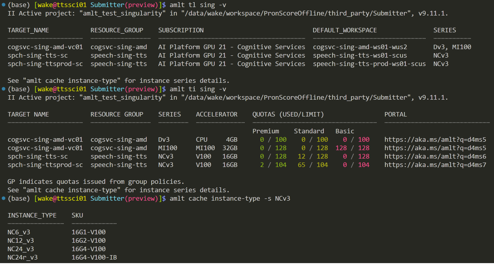
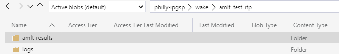
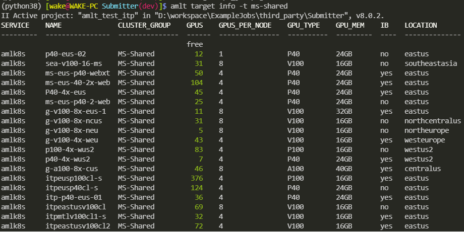
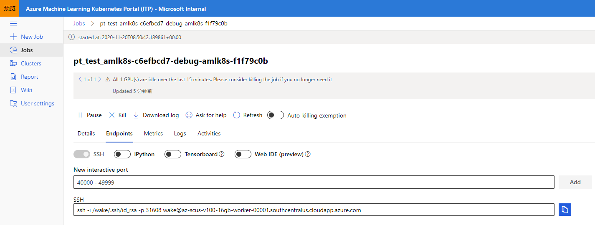
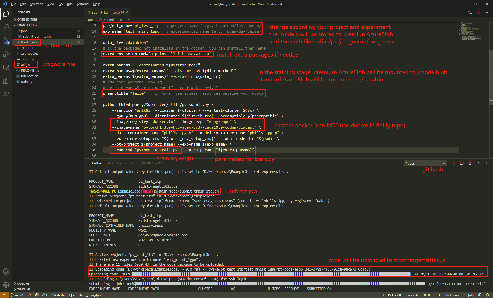
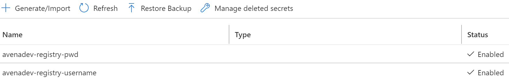

# Introduction

This is a repertory for Microsoft TTS Team ITP job submission. Following the example,
you can submit your job to any **AMLK8s**, a.k.a., Integrated Training Platform (**ITP**), and **Singularity** using
[Amulet](https://amulet-docs.azurewebsites.net/main/setup.html), a.k.a., AMLT.

| System       | Python 3.7.13 | Python 3.8.13 | Python 3.9.12 |
|:------------:|:-------------:|:-------------:|:-------------:|
| Ubuntu 18.04 |   -           |   pass        |   pass        |
| Window 10    |   pass        |   pass        |   pass        |
| Macintosh    |   -           |   -           |   -           |

***During training, standard Azure blob will be mounted to `/datablob` and premium Azure blob will be mounted to `/modelblob` by default. Specifically, data and cluster used for training should be in the same region in order to save the data reading time.***
For example, if you submit a job to `Speech-Azure-SouthCentralUS-V100-16GB` which is located in south central US,
you should upload your data into `stdstoragetts01scus` and the models will be saved to `exawattaiprmbtts01scus`.
For more information about storage, please refer to [Storage Doc](storage.md).

|Storage Type|    Storage Account   | Containers |Folder Name|    Mount Path   |
|:----------:|:--------------------:|:----------:|:---------:|:---------------:|
|Premium     |exawattaiprmbtts01scus|philly-ipgsp|    wake   |`/modelblob/wake`|
|Premium     |exawattaiprmbtts01wus2|philly-ipgsp|    wake   |`/modelblob/wake`|
|Premium     |exawattaiprmbtts01eus |philly-ipgsp|    wake   |`/modelblob/wake`|
|Standard    |stdstoragetts01scus   |philly-ipgsp|    wake   |`/datablob/wake` |
|Standard    |stdstoragetts01wus2   |philly-ipgsp|    wake   |`/datablob/wake` |
|Standard    |stdstoragetts01eus    |philly-ipgsp|    wake   |`/datablob/wake` |

In November 2022, ITP was migrated to Singularity. You can use the following command to check the clusters and quotas you can use.

```bash
# Query the available clusters
amlt tl sing -v  # or amlt target list sing -v

# Query the quotas
amlt ti sing -v # or amlt target info sing -v

# Query the instance series details
amlt cache instance-type -s <series>  # amlt cache instance-type -s NCv3
```



**IMPORTANT:** For your training recipe, please add the following code to save your models and tensorboard files. If you use the following code to write tensorboard file to `log_dir`,
you can use the tensorboard services provided by ITP team.
**Moreover, you do NOT need to set `--model-dir` and `--log-dir` by yourself when you use `utils/amlt_submit.py` to submit job to ITP. The two parameters will be automatically set by `utils/amlt_submit.py`.**

```python
parser.add_argument('--model-dir', type=Path, required=True, help='model directory')
parser.add_argument('--log-dir', type=Path, default=None, help='log directory')

args = parser.parse_args()
# create log directory to save tensorboard
# summary written in the default directory can be shown on ITP Portal
if args.log_dir is not None:
    log_dir = args.log_dir
else:
    log_dir = model_dir.joinpath('log')
log_dir.mkdir(parents=True, exist_ok=True)
args.model_dir.mkdir(parents=True, exist_ok=True)
```

You can also disable the setting and write log files and models to anywhere you want by setting `--set-model-dir` as `"false"` for `utils/amlt_submit.py`,
but this setting is **NOT** recommended.

In order to write safe shell script and make the status of job displayed in ITP portal correctly, `set -euo pipefail` is enable by default.
But the default shell of Ubuntu is dash which does not support `-o pipefail`.
Thus, please add the following configures in your docker file.

```bash
# Change default shell to bash
RUN echo "dash dash/sh boolean false" | debconf-set-selections && \
    DEBIAN_FRONTEND=noninteractive dpkg-reconfigure dash
```

> set -o pipefail causes a pipeline (for example, curl -s https://sipb.mit.edu/ | grep foo)
> to produce a failure return code if any command errors.
> Normally, pipelines only return a failure if the last command errors.
> In combination with set -e, this will make your script exit if any command in a pipeline errors.

You can disable the `-o pipefail` feature if you'd like to use dash instead of bash by setting `--use-dash` as `true` for `utils/amlt_submit.py`, but this setting is **NOT** recommended.

## Running examples

1. [**IMPORTANT**] Before submitting job using AMLT, please create a file named `.amltignore` in your project root folder.
This file is very similar with `.gitignore` and will ignore some files which will not be used
during training or inference. I also provided an example, please find it [here](.amltignore).
For more information about AMLT, please refer to [Amulet](https://amulet-docs.azurewebsites.net/master/setup.html).

2. Note that when you first try to launch a job with `utils/amlt_submit.py`, it will need to perform some setup on your machine
(install a few python packages and initialize Amulet project). You will be asked if you want to perform the setup automatically
(usually you should agree). During the setup process, you will see a web link and verification code on your command window.
Open the link in any web browser and input the verification code.

### Examples to submit job

- Submit training job to ITP

    **Before submitting job to ITP, please join the SGs group named "speech-itp-tts-usr" on [IDWeb](https://idweb/identitymanagement/default.aspx).
    Otherwise, you will have no permission to access the resources.
    If you are a vendor or an intern, your also need to join he SGs group named
    "exawatt-users" (FTEs do NOT need to join).**

    ```bash
    # For AML, you'd better use docker images on DockerHub.
    # On Windows, you can use git bash (combined with Visual Studio Code) to run the following command.
    bash jobs/submit_train_amlk8s.sh   # More details, please see the comments.
    ```

    After running this scrips, your code will be uploaded to standard AzureBlob
    (`stdstoragetts01eus/philly-ipgsp/{username}/{project_name}/amlt-code/{random_string}`)
    and training job will be submitted to ITP. The following image shows the folder structure in Microsoft Azure Storage Explorer.
    The models are in `amlt-results` according your cluster's location, `logs` is used to store log files (e.g., tensorboard) by default.

    

  - Use TensorBoard

    ITP team has provided TensorBoard services on their portal. If you follow the guides in introduction part.
    You can use the TensorBoard services like the following:
    

- Submit jobs with different parameters using the same code

    If you want to use the same code to run many jobs with different parameters, you can use the
    [Job List Feature](https://amulet-docs.azurewebsites.net/master/own_jobs.html#define-a-list-of-jobs)
    in Amulet to avoid to upload the same code too many times. We also provide an example
    [script](jobs/submit_train_sing_amd_multi.sh) to use this feature. Then format of the parameters likes the following:

    ```bash
    jobname1&&&--data data1;;;jobname2&&&--data data2;;;jobname2&&&--data data3
    ```

    We use `;;;` to separate the parameters for each job and `&&&` is used to separate the job name and parameters for a particular job.

- Submit training job using [Global Job Dispatcher](https://itp-wiki.azurewebsites.net/guide-for-data-scientists/global-job-scheduler.html)

    Using global job dispatcher (GJD), you are able to make use of underutilized GPU capacity from other teams.
    For more information about how to use, please refer to [submit_train_amlk8s_dist_shared](jobs/submit_train_amlk8s_dist_shared.sh).
    In this script, you need to specify the value of `region`, `num_nodes`, `memory_size`, `gpu_type`, and `use_ib`.
    And the values of these parameters can be found by the following command.

    ```bash
    amlt target info -t ms-shared
    ```

    Then you will see the output like the following:

    

- Submit debugging job to ITP

    1. Upload related codes and data to AzureBlob using [azcopy](https://docs.microsoft.com/en-us/azure/storage/common/storage-use-azcopy-v10) or
    [Microsoft Azure Storage Explore](https://azure.microsoft.com/en-us/features/storage-explorer/).
    Please upload code to premier AzureBlob and this part will be mounted to `/modelblob`.
    Similarly, please upload data to standard AzureBlob and this part will be mounted to `/datablob`.
    I have also provided some examples on how to use `azcopy`. Please find them in `tools/linux`
    or in `tools/windows`. By the way, please upload the codes and data to the Azure storage according to your computing resources' location.
    2. Submit debugging job

        ```bash
        # GPU job
        bash jobs/submit_debug_amlk8s.sh

        # CPU job
        bash jobs/submit_debug_amlk8s_cpu.sh
        ```

    3. Copy the ssh command and ssh to the target machine.
    

    4. ***Kill the debugging job.***

# How to use the tools in your personal project

1. Add Submitter as a submodule for your personal project

    ```bash
    mkdir third_party
    cd third_party
    git submodule add git@ssh.dev.azure.com:v3/wangkenpu/Philly/Submitter
    ```

2. Refer to [Example](https://dev.azure.com/wangkenpu/Philly/_git/ExampleJobs?version=GBmain) for your experiments.
Below is an example running with VSCode and Git Bash. **Please note that PT has been updated and renamed to AMLT. So in the following figure, `.ptignore` should also be updated to `.amltignore`**.


3. (Optional) Adding custom Azure blob

    Some users in our team maybe will use custom Azure blob (e.g., personal blob or blob from ASR team).
    You can add your storage configure to our [template YAML file](utils/pt/pt_cfg.yaml).
    For more information, you can refer to [Amulet Doc](https://phillytools.azurewebsites.net/master/workflows/11_multi_storage_configuration.html#).
    The following is an example:

    ```YAML
    storage:
      data_blob:
        storage_account_name: stdstoragetts01scus
        container_name: philly-ipgsp
        mount_dir: /datablob
        mount_options: ["--file-cache-timeout-in-seconds=10000000"]
      output:
        storage_account_name: exawattaiprmbtts01scus
        container_name: philly-ipgsp
        is_output: True                   # optimizes blob mount for write access
        mount_dir: /modelblob
      shared_datastore:
        storage_account_name: teamstorage # your storage account name
        container_name: ptdemo            # container name
        is_output: True                   # if output is true
                                          # else set as false and set configures for mount_options
        mount_dir: /sharedblob            # mount point
    ```

4. (Optional) Using docker in Azure

    You can follow the [example script](jobs/submit_train_amlk8s_azure_docker.sh) to use your docker in Azure.
    The most parts are the same with the regular job, except the following:

    ```bash
    --image-registry "azurecr.io" --image-repo "avenadev" \
    --key-vault-name "avenavault" --docker-username "avenadev-itp" \
    ```

    `avenadev` is your container registry name, `avenavault` is the key vault name to store the secrets.
    In order to authenticate and pull docker successfully on ITP, you should create two secrets using Azure key vault and name
    them as `{container_registry_name}-registry-username` and `{container_registry_name}-registry-pwd` to store the username and
    password like the following:
    

    **If you store the docker image to `sramdevregistry`, please set the `key-vault-name` as `exawatt-philly-ipgsp`.
    We have already stored the key vault to `exawatt-philly-ipgsp` and you don't need to create a new one again.**
    Thus, for our team default Azure Container Registry, you can use the following setting:

    ```bash
    --image-registry "azurecr.io" --image-repo "sramdevregistry" \
    --key-vault-name "exawatt-philly-ipgsp" --docker-username "tts-itp-user" \
    ```

5. Singularity container images

    From December 2022, we have changed form ITP to Singularity. If you want to use custom docker image,
    there are some [requirements](https://singularitydocs.azurewebsites.net/docs/tutorials/custom_images/#requirements-for-custom-image-support) MUST be observed.
    Fortunately, we have provided [AMD](docker/amd/) and [Nvidia](docker/nvidia/) examples to show how to build the custom docker images from scratch.

## Known issues

1. subscription

    > You are currently logged-in to 72f988bf-86f1-41af-91ab-2d7cd011db47 tenant. > > You don't have access to 48b6cd5e-3ffe-4c2e-9e99-5760a42cd093 subscription,
    > please check if it is in this tenant. All the subscriptions that you have access to in this tenant are =...

    You need to delete the `~/.azure*`, or use python script to update your tenant id:

    ``` python
    from azureml.core import Workspace
    from azureml.core.authentication import InteractiveLoginAuthentication

    interactive_auth = InteractiveLoginAuthentication(tenant_id="72f988bf-86f1-41af-91ab-2d7cd011db47", force=True)

    ws = Workspace(subscription_id="48b6cd5e-3ffe-4c2e-9e99-5760a42cd093",
            resource_group="speech-itp-tts",
            workspace_name="speech-itp-tts-ws01-scus",
            auth=interactive_auth)

    print(ws)
    ```

2. Submitting jobs from Linux Non-Managed Devices

    Those of you who can't submit jobs from a non-managed device (such an azure vm or gcr linux machine not in corpnet), try the following:

    Join the Active Linux Users group following the description at this link:
    [Remote access on Linux devices](https://microsoft.sharepoint.com/sites/Network_Connectivity/SitePages/RemoteAccess/Remote-access-on-Linux-devices.aspx).
    Once that is done, wait for a bit, then try pt commands again.
    If that still doesn't work, re-install azure-cli and type az login, manually enter email and use phone auth (instead of cert, current user, etc..).

3. Cannot uninstall 'ruamel-yaml'

    > ERROR: Cannot uninstall 'ruamel-yaml'. It is a distutils installed project and > thus we cannot accurately determine which files belong to it which would lead > to only a partial uninstall.

    1. check the installed path of ruamel

        ```bash
        pip -V
        # output
        # pip 21.0.1 from /data/wake/tools/miniconda3/lib/python3.8/site-packages/pip (python 3.8)
        ```

    2. delete installed ruamel

        ```bash
        # remember to change to your path
        rm -rf /data/wake/tools/miniconda3/lib/python3.8/site-packages/ruamel*
        ```

    Then, re-submit your job.

4. target name not found

    > CC The provided target name "itp-v100-scus" could not be found.
    > EE Check "pt target list" for valid values.
    > EE You can add targets via "pt target add" or "pt target add-defaults".

    This is because you use a new cluster (or AML compute) named `itp-v100-scus` that you never used before.
    Thus you need to refresh your computing target list. Please use the following command to refresh the target list.

    ```bash
    # refresh amlk8s compute resource
    amlt targe list amlk8s
    # refresh singularity compute resource
    amlt targe list sing -v
    ```

    Then, you can re-submit your job successfully.

## Note

### Links

- [ITP Portal](https://ml.azure.com/clusters?flight=itpmerge)
- [ITP Document](https://k8s-wiki.azureml.com/overview.html)
- [ITP IcM Ticket](https://portal.microsofticm.com/imp/v3/incidents/create?tmpl=uGQ3H1)
- [Amulet](https://amulet-docs.azurewebsites.net/main/index.html)
- [Dockers](https://hub.docker.com/u/wangkenpu)
- [Singularity](https://singularitydocs.azurewebsites.net/docs/overview/concepts/)

## Update tools

```bash
bash tools/linux/update_submitter_tools.sh
```

## Modify Username

1. Windows: username and password are stored at `C:\Users\[alias]\AppData\Roaming\amulet`
2. Linux: username and password are stored at `$HOME/.config/amulet`
