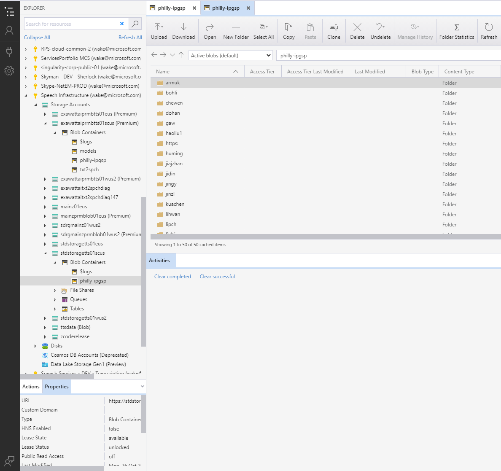

# Introduction

In Microsoft Azure TTS team, we use Azure Blob Storage to store our training data and models. Azure block blob storage offers two different performance tiers: **standard** and **premium**.

Please note that, in order to save the storage cost as we synced in 2020, data should be stored to standard Azure blob, which will be permanently saved.
Model should be saved to premium Azure blob, and the data in premium blob will be deleted automatically according to the policy made by the administrator (e.g., the data has not be accessed for 30 days will be delete automatically.).
If the training is finished, you can copy the final models from premium blob to standard blob.

# Manage Data

There are two ways to manage your data on Azure blobs. One is using [Azure Storage Explore](https://azure.microsoft.com/en-us/features/storage-explorer/), another is using [AzCopy](https://docs.microsoft.com/en-us/azure/storage/common/storage-use-azcopy-v10).

Azure Storage Explore is feature-rich graphical user interface (GUI) for full management of cloud storage resources.
And `azcopy` is a command-line utility that you can use to copy blobs or files to or from a storage account.

## Accounts

The following figure shows the storage accounts and blob containers we can used for model training.

|Region          |Standard           |Premium               |
|:--------------:|:-----------------:|:--------------------:|
|East US         |stdstoragetts01eus |exawattaiprmbtts01eus |
|West US2        |stdstoragetts01wus2|exawattaiprmbtts01wus2|
|South Central US|stdstoragetts01scus|exawattaiprmbtts01scus|

You can create a folder (please use your alias as folder name) in the standard containers named `philly-ipgsp`and upload data into it using Azure Storage Explore or `azcopy`.

## AzCopy

Please refer to [AzCopy Document](https://docs.microsoft.com/en-us/azure/storage/common/storage-use-azcopy-v10) for more details on how to upload and download and the following figure shows how to get SAS token for AzCopy.
